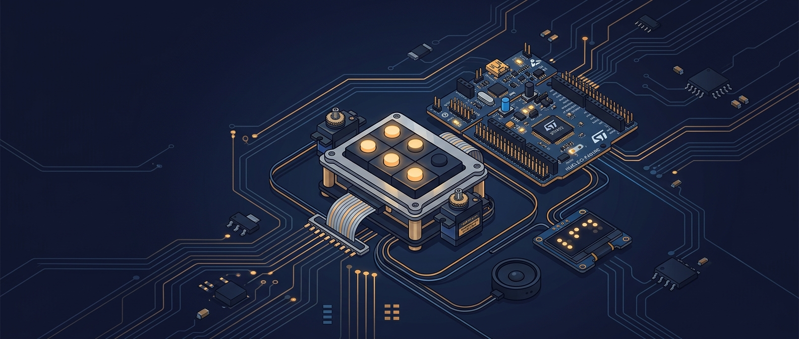

<p align="center">
  
</p>

<h1 align="center">Traductor de Texto a Braille — STM32F411RE</h1>

<p align="center">
  <strong>Sistema embebido multimodal que traduce texto en español a Braille mediante interfaz háptica, visual y sonora</strong>
</p>

<p align="center">
  
  
  
  
  
</p>

---

## 📋 Descripción

Este proyecto implementa un **traductor de texto a Braille en tiempo real** sobre la plataforma NUCLEO-F411RE. El sistema recibe palabras en español a través del puerto serial (UART), y reproduce cada letra de forma cíclica con tres modalidades simultáneas y sincronizadas:

| Modalidad | Hardware | Descripción |
|:---|:---|:---|
| 🤚 **Háptica** | 6 micro servomotores | Celda Braille física de 6 puntos — cada servo eleva o retrae un pin del signo generador |
| 👁️ **Visual** | Display OLED SSD1306 | Muestra la letra actual (escala 4x), celda Braille gráfica, progreso y estado |
| 🔊 **Sonora** | Amplificador I2S MAX98357A | Reproduce clips de audio en español al ajustar la velocidad con el encoder |

El principio arquitectónico clave es una **Única Fuente de Verdad (Single Source of Truth):** cada carácter se traduce a una máscara de 6 bits (`uint8_t`), donde los bits 0–5 corresponden a los puntos 1–6 del signo generador Braille. Esa misma máscara alimenta tanto la lógica de dibujo de la OLED como la posición angular de los servos, haciendo imposible la desincronización entre el hardware físico y la representación gráfica.

---

## 🏗️ Arquitectura del Sistema

```
                         ┌──────────────────────────────────────────┐
    Terminal Serial      │          STM32F411RE @ 96 MHz            │
    (115200 8N1)         │                                          │
         │               │  ┌──────────┐    ┌───────────────────┐   │
  ┌──────┴──────┐        │  │  USART2  │───▶│  Parser UTF-8     │   │
  │  PC / VCP   │◀──────▶│  │ PA2, PA3 │    │  (soporte 'ñ')    │   │
  │  ST-LINK    │        │  └──────────┘    └────────┬──────────┘   │
  └─────────────┘        │                           │              │
                         │                    ┌──────▼──────┐       │
                         │                    │  braille.c  │       │
                         │                    │  LUT 27 chr  │       │
                         │                    │  → 6-bit mask│       │
                         │                    └──┬───┬───┬──┘       │
                         │         ┌─────────────┘   │   └────────┐ │
                         │         ▼                 ▼            ▼ │
                         │  ┌─────────────┐  ┌────────────┐ ┌──────┐│
                         │  │ TIM3 + TIM4 │  │   I2C1     │ │I2S2 ││
                         │  │ 6ch PWM2    │  │ PB8, PB9   │ │+DMA ││
                         │  │ 50 Hz       │  │ 100 kHz    │ │16kHz││
                         │  └──────┬──────┘  └─────┬──────┘ └──┬──┘│
                         │         │               │           │   │
                         └─────────┼───────────────┼───────────┼───┘
                                   │               │           │
                            ┌──────▼──────┐  ┌─────▼─────┐ ┌──▼───────┐
                            │ 6 Servos    │  │   OLED    │ │MAX98357A │
                            │ (vía opto-  │  │  SSD1306  │ │+ Parlante│
                            │  acopl.)    │  │  128x64   │ │          │
                            └─────────────┘  └───────────┘ └──────────┘

                         ┌───────────────────────────────────────────┐
                         │  Encoder Rotativo (TIM1 Quadrature x4)    │
                         │  PA8 (DT) · PA9 (CLK) · PA10 (Pulsador)  │
                         │  → Controla velocidad de reproducción     │
                         │  → Pulsador: Pausa / Reanudación          │
                         └───────────────────────────────────────────┘
```

---

## ⚙️ Periféricos y Mapa de Pines

| Periférico | Pin(es) | Función AF / Modo | Conexión Física |
|:---|:---|:---|:---|
| **USART2** | PA2, PA3 | AF7 | Terminal serial VCP ST-LINK (115200 8N1) |
| **TIM3 CH1** | PA6 | AF2 — PWM2 | Servo Punto 1 (arriba izq.) |
| **TIM3 CH2** | PA7 | AF2 — PWM2 | Servo Punto 2 (medio izq.) |
| **TIM4 CH1** | PB6 | AF2 — PWM2 | Servo Punto 3 (abajo izq.) |
| **TIM3 CH4** | PB1 | AF2 — PWM2 | Servo Punto 4 (arriba der.) |
| **TIM4 CH2** | PB7 | AF2 — PWM2 | Servo Punto 5 (medio der.) |
| **TIM3 CH3** | PB0 | AF2 — PWM2 | Servo Punto 6 (abajo der.) |
| **TIM1** | PA8, PA9 | AF1 — Encoder TI12 x4 | Encoder rotativo DT / CLK |
| **GPIO** | PA10 | Input Pull-Up | Pulsador encoder (Pausa) |
| **GPIO** | PA11 | Output Push-Pull | SD/Mute amplificador |
| **GPIO** | PH1 | Output | LED de estado |
| **I2C1** | PB8, PB9 | AF4 — Open Drain | Display OLED SSD1306 (0x78) |
| **I2S2 TX** | PB12, PB13, PB15 | AF5 | MAX98357A (WS, BCLK, DIN) |
| **I2S2ext RX** | PB14 | AF6 | Micrófono INMP441 (SD) |
| **DMA1 St4** | — | Mem→Periph Circular | I2S TX audio |
| **DMA1 St3** | — | Periph→Mem Circular | I2S RX audio |
| **TIM10** | — | Base de tiempo 250ms | Secuenciador de letras + blinky |

---

## 🧠 Características Técnicas Destacadas

- **FSM No Bloqueante:** Máquina de estados finitos con 7 estados (`IDLE`, `PROC_UART`, `PROC_ENCODER`, `PROC_BOTON`, `NEXT_LETTER`, `ANUNCIAR`, `REFRESH_OLED`) — sin bloqueos por `delay`.
- **Relojes Dual-PLL:** Sysclk a 96 MHz vía PLL principal; I2SCLK a 76.8 MHz vía PLLI2S dedicado para generar exactamente 16.000 Hz de muestreo con jitter mínimo.
- **Inversión PWM2:** Los optoacopladores de colector abierto invierten la señal física; se compensa usando `TIM_OCMODE_PWM2` directamente en el timer.
- **Parser UTF-8:** Detecta la secuencia `0xC3 0xB1` del carácter 'ñ' y la mapea a código interno `0xF1` para traducción y renderizado con virgulilla.
- **Consola de Calibración en Vivo:** Modo especial (comando `/`) para calibrar anchos de pulso de los 6 servos con pasos fino (5 µs) y grueso (50 µs), con límites de seguridad y exportación de tabla C.
- **Audio PCM en Flash:** ~72 KB de clips de voz ("uno", "dos", "tres") almacenados como arreglos `const` en Flash, reproducidos vía DMA circular.
- **Recuperación de Bus I2C:** Rutina `BusRecover` con bit-banging de hasta 9 pulsos SCL para desatascar el bus tras reset abrupto.

---

## 📁 Estructura del Proyecto

```
stm32proyecto_tallerv/
├── Inc/                          # Headers
│   ├── braille.h                 # Máscaras de 6 bits del signo generador
│   ├── clips_voz.h               # Declaraciones de clips PCM
│   ├── ssd1306.h                 # Driver display OLED I2C
│   └── stm32f4xx_hal_conf.h      # Configuración de módulos HAL
├── Src/                          # Código fuente
│   ├── main.c                    # ★ Programa principal integrado
│   ├── braille.c                 # LUT alfabeto español (27 caracteres)
│   ├── clips_voz.c               # Muestras PCM 16-bit @ 16 kHz
│   ├── ssd1306.c                 # Driver OLED (framebuffer + primitivas)
│   ├── main_diag_oled.c          # Test: diagnóstico display I2C
│   ├── main_test_audio.c         # Test: generador de tonos I2S
│   ├── main_test_mic.c           # Test: captura micrófono + vúmetro
│   ├── main_test_fullduplex.c    # Test: eco full-duplex I2S
│   ├── main_grabadora.c          # Test: grabadora + recorte de silencio
│   ├── main_encoder_voz.c        # Test: encoder + audio integrado
│   ├── stm32f4xx_it.c            # ISRs del proyecto integrado
│   └── ...                       # Archivos de sistema (syscalls, startup)
├── Drivers/                      # HAL STM32F4xx
├── Startup/                      # Vector de interrupciones (ASM)
├── STM32F411RETX_FLASH.ld        # Linker script (Flash)
└── STM32F411RETX_RAM.ld          # Linker script (RAM)
```

---

## 🔧 Requisitos de Hardware

| Componente | Cantidad | Descripción |
|:---|:---:|:---|
| NUCLEO-F411RE | 1 | Placa de desarrollo STM32 |
| Micro Servo (SG90 o similar) | 6 | Actuadores de la celda Braille |
| Optoacoplador (PC817 o similar) | 6 | Aislamiento eléctrico servo ↔ MCU |
| Display OLED SSD1306 | 1 | 128x64 píxeles, interfaz I2C |
| MAX98357A | 1 | Amplificador I2S Clase D con parlante |
| INMP441 | 1 | Micrófono MEMS I2S (usado en pruebas) |
| Encoder rotativo | 1 | Con pulsador integrado |
| Fuente 5V / 2A | 1 | Alimentación de servos (separada del MCU) |

---

## 🚀 Compilación y Flasheo

1. Abrir el proyecto en **STM32CubeIDE**
2. Importar: `File → Import → Existing Projects into Workspace`
3. Seleccionar la carpeta `stm32proyecto_tallerv/`
4. Compilar: `Project → Build All` (o `Ctrl+B`)
5. Flashear: `Run → Debug As → STM32 C/C++ Application`

### Uso por Terminal Serial

```bash
# Conectar al puerto serial (Linux)
minicom -D /dev/ttyACM0 -b 115200

# Enviar una palabra para traducir
hola

# Entrar al modo calibración de servos
/
```

---

## 📄 Licencia

Este proyecto está bajo la licencia [MIT](LICENSE).

---

<p align="center">
  <em>Proyecto desarrollado para el curso de Sistemas Embebidos — Taller V</em><br>
  <em>Universidad Nacional de Colombia</em>
</p>
